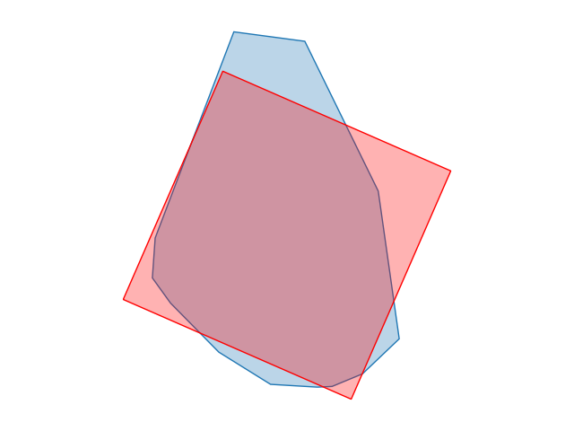
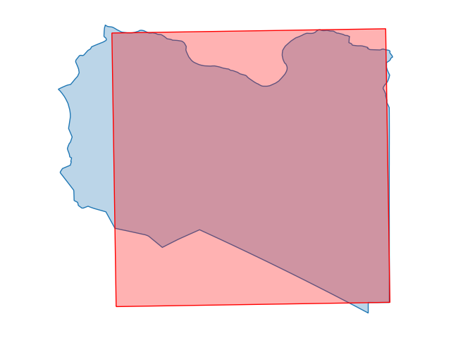
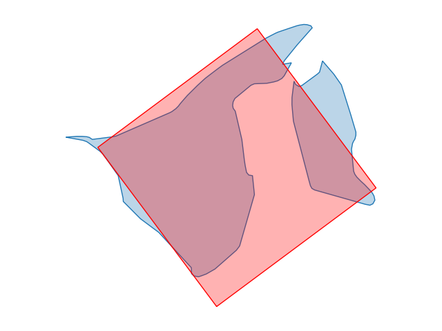
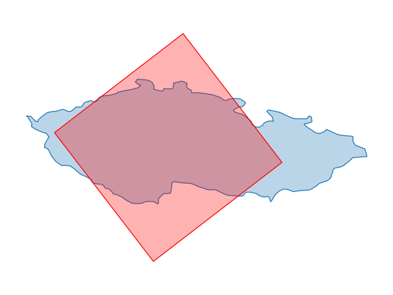
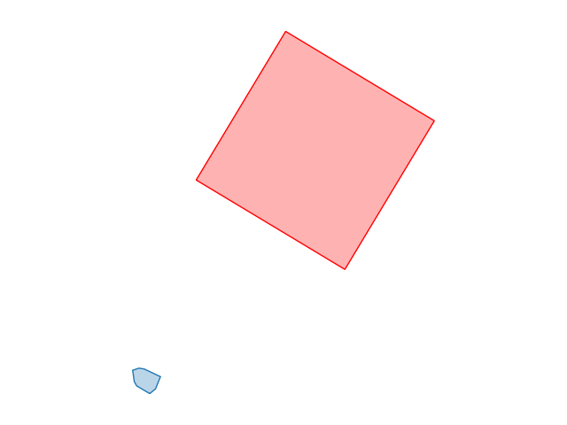

# Country Shape Tester
## Countries
The following countries were tested:
- Montserrat
- Libya
- Malta
- Brunei
- Czech Republic
- United Arab Emirates
- Guadeloupe
- Laos
- Tuvalu
- Norfolk Island

## Results
The following table shows the scores and optimal shape parameters for each country:
| Country | Error | Image |
|---------|-------|------------|
| Montserrat | 24.87% |  |
| Libya | 29.69% |  |
| Malta | 33.41% |  |
| Brunei | 44.58% |  |
| Czech Republic | 45.21% |  |
| United Arab Emirates | 46.93% |  |
| Guadeloupe | 49.46% |  |
| Laos | 50.90% |  |
| Tuvalu | 94.82% |  |
| Norfolk Island | 100.00% |  |
