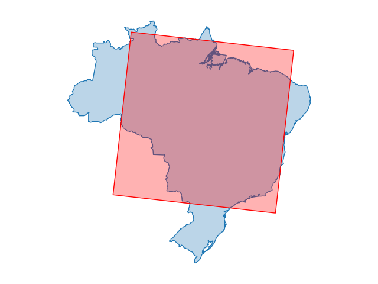
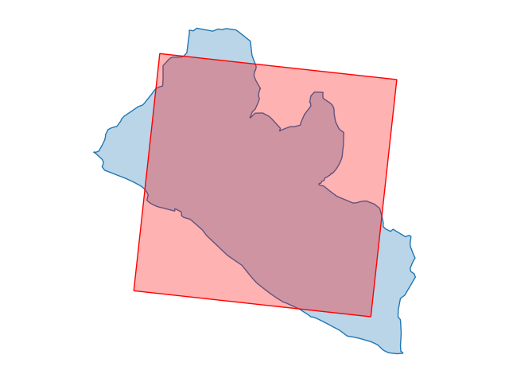
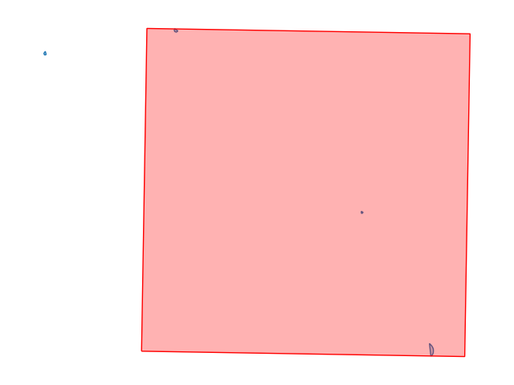
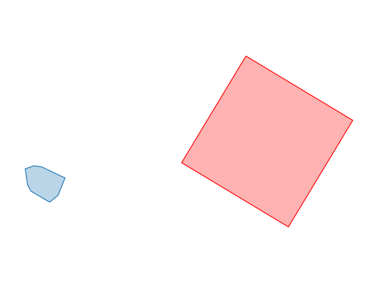
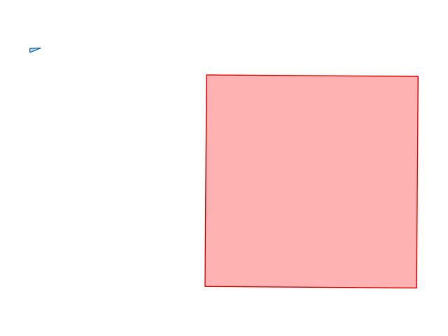

# Country Shape Tester
## Countries
The following countries were tested:
- Egypt
- Ivory Coast
- Swaziland
- Sierra Leone
- Suriname
- Angola
- Kenya
- Uruguay
- Zimbabwe
- Germany
- Gabon
- Reunion
- Botswana
- Montenegro
- Uganda
- Ethiopia
- Colombia
- South Korea
- Zaire
- France
- Mauritania
- Nigeria
- Tanzania, United Republic of
- Algeria
- Montserrat
- Nicaragua
- Spain
- Sudan
- Andorra
- Lesotho
- Cambodia
- Bolivia
- Senegal
- Ecuador
- Finland
- Burundi
- St. Vincent and the Grenadines
- Luxembourg
- Ireland
- Iraq
- Niger
- Djibouti
- India
- Libya
- Chad
- French Guiana
- Saudi Arabia
- Singapore
- Grenada
- Kuwait
- Serbia
- Iran
- Sri Lanka
- Romania
- Rwanda
- Ghana
- Guatemala
- St. Lucia
- Macedonia
- Syria
- Qatar
- Equatorial Guinea
- Cameroon
- Malta
- Sao Tome and Principe
- Bosnia and Herzegovina
- Poland
- Afghanistan
- Australia
- Namibia
- Netherlands
- Byelarus
- Bangladesh
- Myanmar (Burma)
- Brazil
- Trinidad and Tobago
- Barbados
- South Africa
- Honduras
- Bhutan
- Thailand
- Lithuania
- Tunisia
- Dominican Republic
- Venezuela
- Benin
- Heard Island & McDonald Islands
- Albania
- Monaco
- Eritrea
- Cocos (Keeling) Islands
- Armenia
- Dominica
- Jordan
- Martinique
- West Bank
- Azerbaijan
- Moldova
- Zambia
- Taiwan
- Argentina
- North Korea
- Man, Isle of
- Morocco
- Hong Kong
- Burkina Faso
- Switzerland
- Guinea-Bissau
- Guinea
- Denmark
- Belgium
- Bulgaria
- Austria
- Madagascar
- Liberia
- Mali
- Papua New Guinea
- Haiti
- Mayotte
- Pacific Islands (Palau)
- Guyana
- Paraguay
- Greenland
- St. Kitts and Nevis
- Brunei
- American Samoa
- Slovenia
- Belize
- Kazakhstan
- Czech Republic
- Hungary
- Estonia
- Jamaica
- Lebanon
- Sweden
- Turkmenistan
- El Salvador
- Costa Rica
- Cyprus
- Peru
- Ukraine
- United Arab Emirates
- Antigua and Barbuda
- Central African Republic
- Pakistan
- Congo
- Oman
- Mongolia
- China
- Greece
- Puerto Rico
- Portugal
- United Kingdom
- Guadeloupe
- Mozambique
- Bahrain
- Mexico
- Yemen
- Western Sahara
- Tajikistan
- Georgia
- Laos
- Croatia
- French Southern & Antarctic Lands
- Virgin Islands
- Israel
- Jersey
- Anguilla
- Western Samoa
- Kyrgyzstan
- Turkey
- Slovakia
- Latvia
- Iceland
- United States of America
- Cayman Islands
- Canada
- Somalia
- Seychelles
- Guam
- Italy
- Gaza Strip
- Nepal
- Norway
- Faroe Islands
- Uzbekistan
- Togo
- Jan Mayen
- Malawi
- Falkland Islands (Islas Malvinas)
- Russia
- Panama
- Svalbard
- Wallis and Futuna
- Vietnam
- St. Pierre and Miquelon
- Kiribati
- South Georgia and the South Sandwich Is
- Turks and Caicos Islands
- New Caledonia
- Japan
- Philippines
- Gambia, The
- Tonga
- Indonesia
- Vanuatu
- Cook Islands
- Federated States of Micronesia
- Cuba
- Solomon Islands
- Marshall Islands
- Chile
- Cape Verde
- British Virgin Islands
- French Polynesia
- Antarctica
- Malaysia
- Netherlands Antilles
- Comoros
- Bahamas, The
- Mauritius
- Pitcairn Islands
- Tuvalu
- New Zealand
- Paracel Islands
- Spratly Islands
- Maldives
- Fiji
- Norfolk Island
- Liechtenstein
- Midway Islands
- Aruba
- Jarvis Island
- Niue
- Northern Mariana Islands
- Macau
- British Indian Ocean Territory
- San Marino
- Baker Island
- Wake Island
- Bouvet Island
- St. Helena
- Nauru
- Glorioso Islands
- Johnston Atoll
- Bermuda
- Juan De Nova Island
- Guernsey
- Tokelau
- Howland Island
- Gibraltar
- Christmas Island

## Results
The following table shows the scores and optimal shape parameters for each country:
| Country | Error | Image |
|---------|-------|------------|
| Egypt | 9.33% |  |
| Ivory Coast | 15.65% |  |
| Swaziland | 15.69% |  |
| Sierra Leone | 16.12% |  |
| Suriname | 17.85% |  |
| Angola | 18.97% |  |
| Kenya | 19.39% |  |
| Uruguay | 19.53% |  |
| Zimbabwe | 19.89% |  |
| Germany | 20.56% |  |
| Gabon | 21.20% |  |
| Reunion | 21.89% |  |
| Botswana | 21.90% |  |
| Montenegro | 22.12% |  |
| Uganda | 22.29% |  |
| Ethiopia | 22.30% |  |
| Colombia | 22.80% |  |
| South Korea | 22.85% |  |
| Zaire | 23.03% |  |
| France | 23.58% |  |
| Mauritania | 23.60% |  |
| Nigeria | 23.63% |  |
| Tanzania, United Republic of | 24.39% |  |
| Algeria | 24.67% |  |
| Montserrat | 24.87% |  |
| Nicaragua | 25.03% |  |
| Spain | 25.93% |  |
| Sudan | 25.99% |  |
| Andorra | 26.29% |  |
| Lesotho | 26.52% |  |
| Cambodia | 26.81% |  |
| Bolivia | 27.03% |  |
| Senegal | 27.94% |  |
| Ecuador | 28.04% |  |
| Finland | 28.15% |  |
| Burundi | 28.26% |  |
| St. Vincent and the Grenadines | 28.26% |  |
| Luxembourg | 28.70% |  |
| Ireland | 28.83% |  |
| Iraq | 29.00% |  |
| Niger | 29.00% |  |
| Djibouti | 29.55% |  |
| India | 29.59% |  |
| Libya | 29.69% |  |
| Chad | 29.78% |  |
| French Guiana | 29.94% |  |
| Saudi Arabia | 30.00% |  |
| Singapore | 30.28% |  |
| Grenada | 30.47% |  |
| Kuwait | 30.58% |  |
| Serbia | 30.74% |  |
| Iran | 31.03% |  |
| Sri Lanka | 31.24% |  |
| Romania | 31.33% |  |
| Rwanda | 31.50% |  |
| Ghana | 31.79% |  |
| Guatemala | 32.08% |  |
| St. Lucia | 32.15% |  |
| Macedonia | 32.17% |  |
| Syria | 32.37% |  |
| Qatar | 33.29% |  |
| Equatorial Guinea | 33.29% |  |
| Cameroon | 33.39% |  |
| Malta | 33.41% |  |
| Sao Tome and Principe | 33.49% |  |
| Bosnia and Herzegovina | 33.69% |  |
| Poland | 33.75% |  |
| Afghanistan | 33.76% |  |
| Australia | 34.18% |  |
| Namibia | 34.20% |  |
| Netherlands | 34.28% |  |
| Byelarus | 34.28% |  |
| Bangladesh | 34.37% |  |
| Myanmar (Burma) | 34.52% | .png) |
| Brazil | 35.18% |  |
| Trinidad and Tobago | 35.21% |  |
| Barbados | 35.69% |  |
| South Africa | 36.10% |  |
| Honduras | 36.88% |  |
| Bhutan | 37.40% |  |
| Thailand | 37.47% |  |
| Lithuania | 37.54% |  |
| Tunisia | 37.62% |  |
| Dominican Republic | 37.89% |  |
| Venezuela | 37.90% |  |
| Benin | 37.90% |  |
| Heard Island & McDonald Islands | 37.95% |  |
| Albania | 38.48% |  |
| Monaco | 38.63% |  |
| Eritrea | 38.89% |  |
| Cocos (Keeling) Islands | 38.95% | _islands.png) |
| Armenia | 39.01% |  |
| Dominica | 39.43% |  |
| Jordan | 39.77% |  |
| Martinique | 40.16% |  |
| West Bank | 40.26% |  |
| Azerbaijan | 40.29% |  |
| Moldova | 40.29% |  |
| Zambia | 40.57% |  |
| Taiwan | 40.86% |  |
| Argentina | 41.11% |  |
| North Korea | 41.18% |  |
| Man, Isle of | 41.34% |  |
| Morocco | 41.45% |  |
| Hong Kong | 41.64% |  |
| Burkina Faso | 41.71% |  |
| Switzerland | 41.78% |  |
| Guinea-Bissau | 41.84% |  |
| Guinea | 42.03% |  |
| Denmark | 42.27% |  |
| Belgium | 42.41% |  |
| Bulgaria | 42.47% |  |
| Austria | 42.50% |  |
| Madagascar | 42.62% |  |
| Liberia | 42.82% |  |
| Mali | 42.83% |  |
| Papua New Guinea | 43.09% |  |
| Haiti | 43.68% |  |
| Mayotte | 43.68% |  |
| Pacific Islands (Palau) | 43.68% | .png) |
| Guyana | 43.71% |  |
| Paraguay | 43.78% |  |
| Greenland | 44.10% |  |
| St. Kitts and Nevis | 44.55% |  |
| Brunei | 44.58% |  |
| American Samoa | 44.99% |  |
| Slovenia | 45.01% |  |
| Belize | 45.11% |  |
| Kazakhstan | 45.17% |  |
| Czech Republic | 45.21% |  |
| Hungary | 45.71% |  |
| Estonia | 45.89% |  |
| Jamaica | 45.93% |  |
| Lebanon | 46.06% |  |
| Sweden | 46.09% |  |
| Turkmenistan | 46.16% |  |
| El Salvador | 46.40% |  |
| Costa Rica | 46.66% |  |
| Cyprus | 46.80% |  |
| Peru | 46.81% |  |
| Ukraine | 46.89% |  |
| United Arab Emirates | 46.93% |  |
| Antigua and Barbuda | 47.25% |  |
| Central African Republic | 47.43% |  |
| Pakistan | 47.68% |  |
| Congo | 48.01% |  |
| Oman | 48.03% |  |
| Mongolia | 48.05% |  |
| China | 48.06% |  |
| Greece | 48.82% |  |
| Puerto Rico | 48.95% |  |
| Portugal | 49.08% |  |
| United Kingdom | 49.38% |  |
| Guadeloupe | 49.46% |  |
| Mozambique | 49.76% |  |
| Bahrain | 50.18% |  |
| Mexico | 50.50% |  |
| Yemen | 50.51% |  |
| Western Sahara | 50.61% |  |
| Tajikistan | 50.83% |  |
| Georgia | 50.87% |  |
| Laos | 50.90% |  |
| Croatia | 51.04% |  |
| French Southern & Antarctic Lands | 51.22% |  |
| Virgin Islands | 51.37% |  |
| Israel | 51.47% |  |
| Jersey | 51.84% |  |
| Anguilla | 52.54% |  |
| Western Samoa | 52.78% |  |
| Kyrgyzstan | 52.87% |  |
| Turkey | 53.06% |  |
| Slovakia | 53.17% |  |
| Latvia | 53.34% |  |
| Iceland | 53.38% |  |
| United States of America | 53.68% |  |
| Cayman Islands | 54.07% |  |
| Canada | 54.20% |  |
| Somalia | 54.67% |  |
| Seychelles | 54.83% |  |
| Guam | 55.47% |  |
| Italy | 55.48% |  |
| Gaza Strip | 55.64% |  |
| Nepal | 56.01% |  |
| Norway | 57.09% |  |
| Faroe Islands | 58.56% |  |
| Uzbekistan | 58.82% |  |
| Togo | 59.12% |  |
| Jan Mayen | 59.78% |  |
| Malawi | 60.02% |  |
| Falkland Islands (Islas Malvinas) | 61.54% | .png) |
| Russia | 63.54% |  |
| Panama | 64.29% |  |
| Svalbard | 64.53% |  |
| Wallis and Futuna | 64.61% |  |
| Vietnam | 64.61% |  |
| St. Pierre and Miquelon | 65.42% |  |
| Kiribati | 66.82% |  |
| South Georgia and the South Sandwich Is | 67.50% |  |
| Turks and Caicos Islands | 69.37% |  |
| New Caledonia | 69.99% |  |
| Japan | 70.79% |  |
| Philippines | 71.89% |  |
| Gambia, The | 72.24% |  |
| Tonga | 73.92% |  |
| Indonesia | 74.13% |  |
| Vanuatu | 75.00% |  |
| Cook Islands | 77.09% |  |
| Federated States of Micronesia | 77.51% |  |
| Cuba | 78.80% |  |
| Solomon Islands | 79.77% |  |
| Marshall Islands | 79.88% |  |
| Chile | 79.92% |  |
| Cape Verde | 84.85% |  |
| British Virgin Islands | 85.06% |  |
| French Polynesia | 85.45% |  |
| Antarctica | 85.70% |  |
| Malaysia | 86.06% |  |
| Netherlands Antilles | 88.18% |  |
| Comoros | 89.82% |  |
| Bahamas, The | 93.25% |  |
| Mauritius | 95.00% |  |
| Pitcairn Islands | 99.78% |  |
| Tuvalu | 99.96% |  |
| New Zealand | 99.98% |  |
| Paracel Islands | 99.98% |  |
| Spratly Islands | 99.98% |  |
| Maldives | 100.00% |  |
| Fiji | 100.00% |  |
| Norfolk Island | 100.00% |  |
| Liechtenstein | 100.00% |  |
| Midway Islands | 100.00% |  |
| Aruba | 100.00% |  |
| Jarvis Island | 100.00% |  |
| Niue | 100.00% |  |
| Northern Mariana Islands | 100.00% |  |
| Macau | 100.00% |  |
| British Indian Ocean Territory | 100.00% |  |
| San Marino | 100.00% |  |
| Baker Island | 100.00% |  |
| Wake Island | 100.00% |  |
| Bouvet Island | 100.00% |  |
| St. Helena | 100.00% |  |
| Nauru | 100.00% |  |
| Glorioso Islands | 100.00% |  |
| Johnston Atoll | 100.00% |  |
| Bermuda | 100.00% |  |
| Juan De Nova Island | 100.00% |  |
| Guernsey | 100.00% |  |
| Tokelau | 100.00% |  |
| Howland Island | 100.00% |  |
| Gibraltar | 100.00% |  |
| Christmas Island | 100.00% |  |
